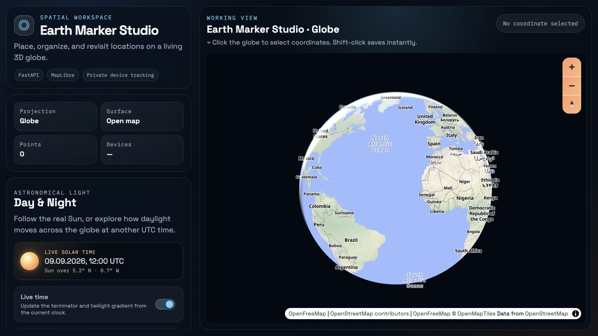
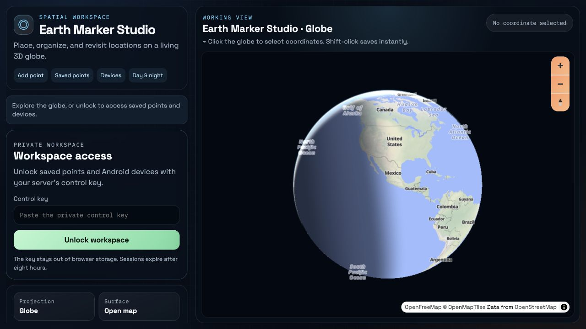
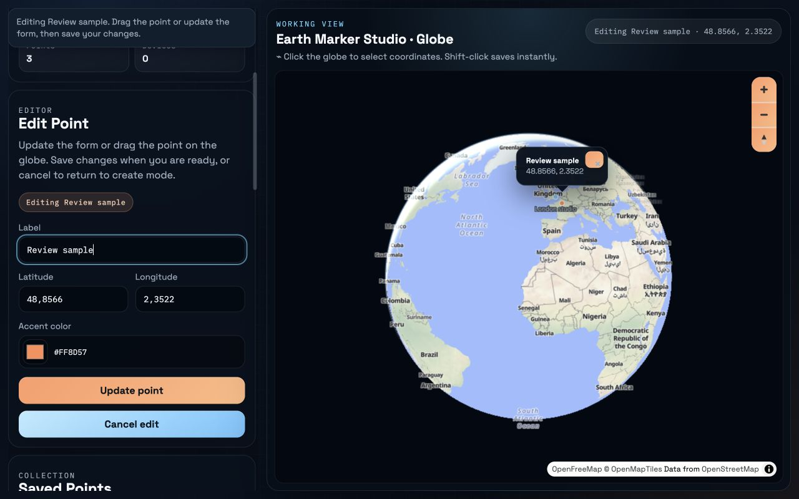
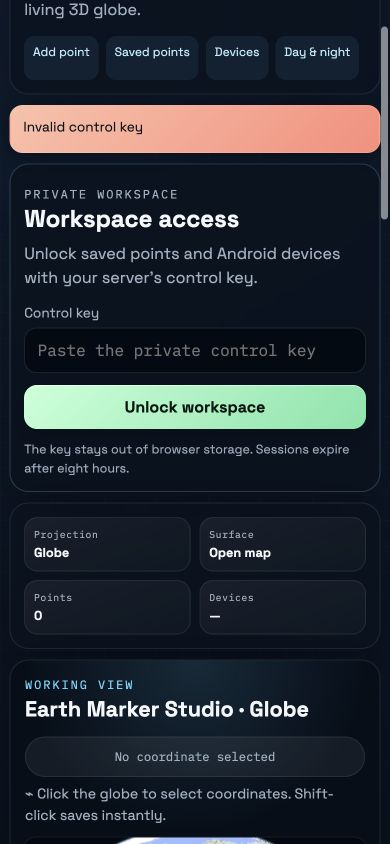
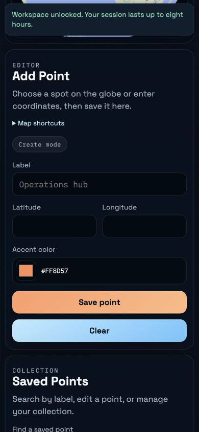

# Codebase review and improvements — 9 September 2026

Earth Marker Studio 0.4.0 protects the entire private workspace, makes common actions easier to find, and fixes several persistence, rendering, and device-reliability issues. Android companion version 0.2.1 includes stricter server URL validation.

## Findings and changes

| Priority | Finding | Implemented change |
| --- | --- | --- |
| High | Saved points were publicly readable and editable, including bulk deletion. | Every point endpoint now requires the existing control key or an authenticated browser session. |
| High | The browser retained the long-lived control key in session storage. | Exchange it for a random, eight-hour HttpOnly cookie. Store only its hash server-side, revoke on logout, invalidate when the control key changes, and remove legacy browser storage. |
| High | Browser sessions need protection against cross-site writes and guessing. | SameSite=Strict, Secure cookies on HTTPS, origin checks, database-backed login/pairing rate limits, and no-store API responses. |
| High | Android treated hostnames such as `10.attacker.example` as private IP addresses. | Validate all four IPv4 octets; reject misleading public hostnames. Disable automatic redirects for requests carrying credentials. |
| Medium | An in-flight refresh or queued mutation could repopulate data after locking. | Cancel pending requests and invalidate old store generations. Lock clears forms, markers, popups, geolocation, and the map selection; notify other tabs. |
| Medium | SQLite transaction context managers did not close database connections. | Explicitly close connections on successful and failed operations. |
| Medium | Independent processes could lose point updates or generate competing admin keys. | File locks serialize read-modify-write operations and key initialization. Corrupt existing keys produce an actionable error rather than silent rotation. |
| Medium | Late uploads could overwrite a newer device location in the UI. | Choose the most recent capture time, then receipt time; preserve older history. Add a matching index. |
| Medium | Completed failures and timeouts disappeared from device cards. | Return the latest request alongside active requests and display its error. |
| Medium | Cached old modules broke upgrades to the new authentication client. | Version all local module imports and revalidate application assets. Verified against the browser used for the original baseline. |
| Medium | Map startup depended on points loading, and individual tile errors could prevent the editor from becoming usable. | Start the editor independently, bound map initialization to 20 seconds, and provide an error/reload state. |
| Performance | Every point read parsed and validated the entire JSON document. | Cache validated frozen models and invalidate using file identity, modification time, and size. Keep atomic writes. |
| Performance | Hidden rotation, unchanged device geometry, and repeated solar slider events did unnecessary work. | Pause hidden rotation/solar drawing; skip unchanged geometry and atmosphere colors; coalesce solar draws into animation frames. |
| UX | Access and editing were buried below supplementary settings. | Add section navigation; move access and the editor upward; condense unlocked access; keep status feedback visible. |
| UX | Finding a point required scanning the whole list. | Search by label with result counts and an empty state; batch DOM insertion and defer offscreen card rendering. |
| Accessibility | Editing could focus a popup instead of the form; mobile sticky feedback covered section headings. | Focus the editor label on selection, disable popup autofocus, preserve reduced-motion behavior, and fix scroll offsets. Mobile text inputs use 16px text and controls have larger touch targets. |

## Validation

- Baseline: 15 Python tests and 15 JavaScript tests passed.
- Final: **31 Python tests, 20 JavaScript tests, and 4 Android JVM tests passed**.
- Ruff and JavaScript syntax checks passed; `git diff --check` passed.
- Android `testDebugUnitTest`, `lintDebug`, and `assembleDebug` passed. Lint reports no issues. Gradle printed an existing SDK metadata-version warning on its first run; it did not prevent the build.
- Rebuilt the signed development APK at `downloads/earth-tracker.apk`.
- Browser checks used isolated point/device stores for mutations and the real local server for the final locked preview. No real device pairing or location request was performed.

Regression coverage includes unauthorized point access, cookie attributes, expiry, revocation, control-key rotation, cross-origin writes, login/pairing limits, concurrent writes, key initialization, closed database connections, delayed location uploads, visible timeouts, stale frontend responses, and cancellation of geolocation callbacks.

## Measured performance

On this machine, 100 warm reads of a 5,000-point document averaged **31.483 ms** using the previous parse-and-validate operation and **0.352 ms** using the new cached repository with file locking: approximately **89× faster repository reads**. This is a microbenchmark, not a claim about total page load, map frame rate, or API latency. JSON response serialization still scales with collection size.

Reproduce with `uv run python scripts/benchmark_storage.py`. The benchmark uses temporary synthetic data. No map frame-rate or battery measurements were taken.

## Captured product flows

### 1. Baseline workspace — needed improvement

The globe loaded successfully, but supplementary solar controls occupied the initial sidebar while the editor and device unlock required scrolling. Navigation and feedback placement were the main usability gaps visible in this capture.

### 2. Updated workspace access — verified

Access is visible near the top, private point controls are disabled until unlock, and section shortcuts reach the editor and device tools. The public globe remains available. The final capture uses the same 1280×720 viewport as the baseline.

### 3. Save, search, and edit — verified

Created a synthetic Paris point, filtered the list, selected Edit, and successfully saved a renamed point. Selection focused the form. The screenshot captures the desktop edit step; persistence was verified by the resulting UI state. API tests cover removal and bulk deletion.

### 4. Mobile sign-in error — verified

An incorrect key produced visible feedback, kept private data hidden, and allowed another attempt. Credentials were cleared from the field. Tested at 390×844.

### 5. Mobile editor and locking — verified

The Add point shortcut reaches a complete form whose heading remains below sticky feedback. The document and viewport widths were both 390px, with no horizontal overflow. Locking cleared point lists, form values, device controls, and selection; session revocation is also covered by API tests.

Screenshots were captured during this review and inspected. They support layout and visible-state findings, not a claim of full accessibility compliance. Keyboard focus and form behavior were additionally checked through browser interaction.

## Upgrade and operating limits

Reload existing browser tabs after the upgrade. Use the existing server control key to unlock both saved points and Android devices. API integrations accessing `/api/points` must now send a Bearer control key. Existing point data and device credentials require no migration or re-pairing.

The server remains a single-owner application, without separate accounts, roles, MFA, or SSO. Public access still requires an HTTPS deployment with correctly trusted proxy headers. HTTP remains supported for local development. File-lock guarantees assume a local filesystem; distributed/network storage was not tested. Large point collections still require full JSON writes, and device requests/history have no automatic retention policy.

A physical Android phone, real GPS, notification/battery permissions, background OS behavior, and production reverse-proxy configuration were not exercised. External fonts, map tiles, and the pinned MapLibre CDN asset still require network access. These are explicit validation limits, not completed checks.

## Implementation references

Cookie attributes follow [Starlette's response API](https://starlette.dev/responses/). Explicit database closing addresses the behavior documented in [Python's SQLite connection context manager](https://docs.python.org/3.10/library/sqlite3.html#how-to-use-the-connection-context-manager). The existing static solar canvas configuration is retained, as recommended by [MapLibre's CanvasSourceSpecification](https://maplibre.org/maplibre-gl-js/docs/API/type-aliases/CanvasSourceSpecification/).
